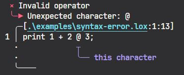

# codecrafters-lox-rust

Rust implementation of [CodeCrafters's "Build your own Interpreter" Challenge](https://app.codecrafters.io/courses/interpreter/overview).

This challenge follows the book
[Crafting Interpreters](https://craftinginterpreters.com/) by Robert Nystrom. It involves building an interpreter for [Lox](https://craftinginterpreters.com/the-lox-language.html), a simple scripting language.

> [!NOTE]
> As of now (2024 Dec), the challenge only supports up to ["Chapter 10 - Functions"](https://craftinginterpreters.com/functions.html). Hence, this solution have not implemented Chapters 11~13 (Resolving and Binding, Classes, Inheritance).

## Running

To run the [Hello World program](./examples/hello_world.lox):

```sh
cargo run -- run examples/hello-world.lox
```

To learn more about the CLI:

```sh
cargo run -- --help
```

## What's done differently?

This implementation deviates from the book in a few ways:

- The parser uses [Pratt Parsing](https://matklad.github.io/2020/04/13/simple-but-powerful-pratt-parsing.html) instead of [Recursive Decent](https://craftinginterpreters.com/parsing-expressions.html#recursive-descent-parsing) to parse expressions.
- Abstract Syntax Tree (AST):
  - Some AST nodes have slightly different names
  - Each AST node stores a `Span` that records the start and end positions of the source code.
- Evaluation:
  - [For-loop desugaring](https://craftinginterpreters.com/control-flow.html#desugaring) is done at evaluation stage instead of parsing stage, so there is an AST node for for-loops.
  - Function call returns are handled using Rust's [`ControlFlow`](https://doc.rust-lang.org/beta/std/ops/enum.ControlFlow.html) instead of ["try-catch" approach](https://craftinginterpreters.com/functions.html#returning-from-calls).
- Error handling:
  - Errors are represented as enums instead of strings. A drawback is that the error messages are generic and does not match the book.
  - [miette](https://github.com/zkat/miette) is used for pretty diagnostic printing. Only the `tokenize` command returns error messages in the book's format in order to pass CodeCrafters' tests. 
    
     

## Inspirations

These implementations greatly influenced the implementation:

- [Implementing a Lox interpreter in Rust - Jon Gjengset](https://youtu.be/mNOLaw-_Buc?si=9zw3pYnsTSI6x4PI)
- [Darksecond/lox](https://github.com/Darksecond/lox)
- [jeschkies/lox-rs](https://github.com/jeschkies/lox-rs)
- [sagark4/rlox_ast_walk](https://github.com/sagark4/rlox_ast_walk)
- [rami3l/dolores](https://github.com/rami3l/dolores)

Also huge thanks to [Oxidation Compiler](https://oxc.rs/) for their resources:
- [JavaScript Parser in Rust](https://oxc.rs/docs/learn/parser_in_rust/intro.html)
- [Performance Optimization Tricks](https://oxc.rs/docs/learn/performance.html)